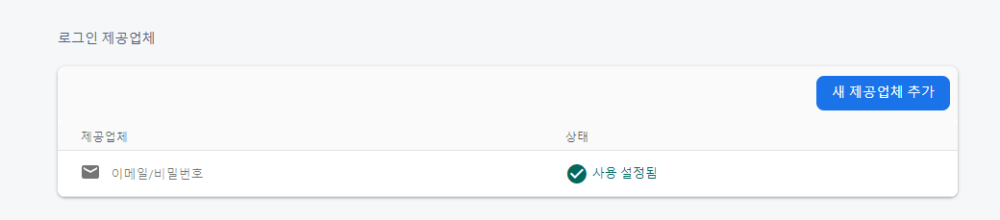
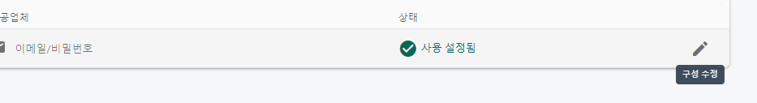

# firebae_auth 를 사용하여 인증하기

- firebase console 에서 `빌드/authentication` 선택
  

## 기본인증 선택하기

- 기본 인증은 `이메일/비밀번호` 로 선택
  
  
  
  

## firebase fireStore 사용하기

- dependency 설치 : `flutter pub add cloud_firestore`
